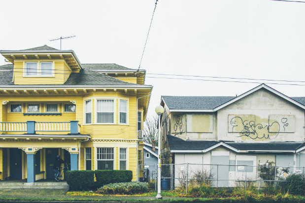

# Gentrification of King County, Washington: 2009 & 2017

### **Research Question: How has gentrification affected King County in the years 2009 and 2017?**

### **Argument: We hypothesize that more census tracts in the Seattle area will be gentrified in the year 2017 when compared to 2009.**

## Context:
According to [Merriam Webster](https://www.merriam-webster.com/dictionary/gentrification), the definition of gentrification is:

> "the process of repairing and rebuilding homes and businesses in a deteriorating area (such as an urban neighborhood) accompanied by an influx of middle-class or affluent people and that often results in the displacement of earlier, usually poorer residents". 

Essentially, gentrification can be thought of as displacing low income, often communities of color to develop new, more expensive properties.



## History of Gentrification in Seattle
### Racial Restrictive Covenants in Seattle

In the past, there were many racial restrictive covenants which were enforceable contracts that if the owner violated it in any way, would result in them risking the property. Much of this specifies that neighborhoods are reserved for whites, and that "Asiatic, African, or Negro blood, lineage, or extraction" are not allowed to occupy the property. This was common after 1926 when the Supreme Court allowed the use of racial restrictions. However, in 1948, the court declared that it no longer be valid. However, even that did nothing to change the segregation that was already in place. Now, the neighborhoods that predominantly consisted of minorities are now being transformed into areas for those of high income, particularly white and Asian American professionals. One of the places that was heavily impacted by racial restrictive covenants was the Central District. In the 20th century, the working-class minority families were forced into the Central District as it was one of the places that allowed minorities to occupy property. Now, gentrification has transformed the area into a place for those of higher income, displacing families of lower income. As the former Seattle mayor Norm Rice stated: gentrification "clearly isn't racist, it's economic". 

### Seattle Tech Boom

Gentrification has been a prime repercussion to Seattle's advancement in technology. With companies like Microsoft, Boeing, and Amazon, many people were displaced due to new construction and heavier rent. Amazon has become one of the largest tech companies throughout the past two decades with lasting changes all throughout Seattle. What Amazon brought to Seattle was not only an influx of techies, but also a change to many Seattle neighborhoods through rising house prices, traffic, as well as construction. The rise of Amazon resulted in a closure many local shops to create higher class redevelopments. With the influx of techies and a significant increase in tech jobs, many companies moved to Seattle in search for employees and vice versa. With this, many local shops had to close due to increased rent, or construction along with the tech boom. At the same time, many people were displaced due to the increased demand of housing, employees, and redevelopment. 

### Seattle Growth
The U.S Census Bureau has released new numbers for population, and it shows that Seattle has now become the nation's fastest growing city in the decade. Adding up all the growth since 2010, Seattle has grown by 18.7 percent which leaves Texas at second place with 17.9 percent.

### Sources:

[Seattle Tech Boom](https://www.businessinsider.com/amazon-hq2-vanishing-seattle-shows-how-the-city-is-gentrifying-2018-2)

[Racial Restrictive Covenants](https://www.seattlemag.com/article/seattles-ugly-past-segregation-our-neighborhoods)

[Gentrification, Integration, or Displacement](https://www.blackpast.org/african-american-history/gentrification-integration-or-displacement-seattle-story/)

## Overview of Data:
We utilized census data from [American Fact Finder](https://factfinder.census.gov/faces/nav/jsf/pages/index.xhtml) for four different demographics that will be discussed later. We decided to focus on King County because we already knew Seattle was a hotspot for gentrification, so we wanted to see if this pattern existed in other parts of the county. Our visualizations will occur at the tract level, since we are familiar with prior datasets that use same. 

2009 and 2017 were the first full years of Obama's & Trump's terms respectively, which is partly why we chose these years.

## Problems with Data: 
Comparing percentages is flawed when there is high population variation among census tracts. Also, housing prices inflate temporally no matter what.

## Methodology & Interactive Maps
To answer our research question, our group decided to conceptualize our understanding of the term gentrification into separate variables. We selected variables based on the the City of Seattle's DPD (Department of Planning and Development) [report](https://www.seattle.gov/dpd/cs/groups/pan/@pan/documents/web_informational/p2273984.pdf?fbclid=IwAR1FXr6J97_m1tCBzHihvBprQveGuptxuODydrdDtHve6wm4gDNYuMQQHm0), which listed several indicators that represented risk of displacement. 
These variables for each tract include: Ethnicity, Educational Attainment, Housing Status (Renters vs. Buyers), and Median Household Value.

```{r setup, results='hide', message=FALSE, warning=FALSE, echo=FALSE}
library(rgdal)
library(sp)
library(leaflet)
library(raster)
library(tmap)
library(dplyr)
library(tigris)
```

```{r include=FALSE, message=FALSE, warning=FALSE, echo=FALSE}
knitr::opts_chunk$set(echo = TRUE)

#loading in the data and cutting it to the columns we need 
#2009
ethnicity2009<-read.csv(file="data/2009_Ethnicity/ACS_09_5YR_B02001_with_ann.csv", header=TRUE, sep=",", stringsAsFactors = FALSE)
ethnicity2009 <- ethnicity2009[-1,c("GEO.id", "GEO.id2","HD01_VD01","HD01_VD02")]
colnames(ethnicity2009)[colnames(ethnicity2009)=="HD01_VD01"] <- "ethnicity.HD01_VD01"
colnames(ethnicity2009)[colnames(ethnicity2009)=="HD01_VD02"] <- "ethnicity.HD01_VD02"

#education
edu2009<-read.csv(file="data/2009_Education_Attainment/ACS_09_5YR_S1501_with_ann.csv", header=TRUE, sep=",", stringsAsFactors = FALSE)
edu2009 <- edu2009[-1,c("GEO.id", "GEO.id2","HC01_EST_VC06","HC01_EST_VC12")]

#housing
housing2009 <-read.csv(file="data/2009_Housing/ACS_09_5YR_B25003_with_ann.csv", header=TRUE, sep=",", stringsAsFactors = FALSE)
housing2009 <- housing2009[-1,c("GEO.id", "GEO.id2","HD01_VD01","HD01_VD03")]

#home value
medianhome2009 <- read.csv(file="data/2009_Median_Household_Value/ACS_09_5YR_B25077_with_ann.csv", header=TRUE, sep=",", stringsAsFactors = FALSE)
medianhome2009 <- medianhome2009[-1,c("GEO.id", "GEO.id2","HD01_VD01")]
colnames(medianhome2009)[colnames(medianhome2009)=="HD01_VD01"] <- "home.HD01_VD01"

#2017 data
#ethnicty
ethnicity2017<-read.csv(file="data/2017_Ethnicity/ACS_17_5YR_B02001_with_ann.csv", header=TRUE, sep=",", stringsAsFactors = FALSE)
ethnicity2017 <- ethnicity2017[-1,c("GEO.id", "GEO.id2","HD01_VD01","HD01_VD02")]
colnames(ethnicity2017)[colnames(ethnicity2017)=="HD01_VD01"] <- "ethnicity.HD01_VD01"
colnames(ethnicity2017)[colnames(ethnicity2017)=="HD01_VD02"] <- "ethnicity.HD01_VD02"

#education
edu2017<-read.csv(file="data/2017_Education_Attainment/ACS_17_5YR_S1501_with_ann.csv", header=TRUE, sep=",", stringsAsFactors = FALSE)
edu2017 <- edu2017[-1,c("GEO.id", "GEO.id2","HC01_EST_VC08","HC01_EST_VC14")]

#poverty
poverty2017 <-read.csv(file="data/2017_Poverty/ACS_17_5YR_S1701_with_ann.csv", header=TRUE, sep=",", stringsAsFactors = FALSE)
poverty2017 <- poverty2017[-1,c("GEO.id", "GEO.id2","HC03_EST_VC01")]

#housing
housing2017 <-read.csv(file="data/2017_Housing/ACS_17_5YR_B25003_with_ann.csv", header=TRUE, sep=",", stringsAsFactors = FALSE)
housing2017 <- housing2017[-1,c("GEO.id", "GEO.id2","HD01_VD01","HD01_VD03")]

#home value
medianhome2017 <- read.csv(file="data/2017_Median_Household_Value/ACS_17_5YR_B25077_with_ann.csv", header=TRUE, sep=",", stringsAsFactors = FALSE)
medianhome2017 <- medianhome2017[-1,c("GEO.id", "GEO.id2","HD01_VD01")]
colnames(medianhome2017)[colnames(medianhome2017)=="HD01_VD01"] <- "home.HD01_VD01"


```
```{r message=FALSE, warning=FALSE, echo=FALSE}
#get percentage for each variable and create z scores for each percentage
#get percent white population count
ethnicity2009 <- ethnicity2009 %>% 
  mutate(percentwhite = (as.numeric(ethnicity.HD01_VD02)/as.numeric(ethnicity.HD01_VD01)) * 100)

ethnicity2009 <- ethnicity2009 %>% 
  mutate(percentcolor = ((as.numeric(ethnicity.HD01_VD01)- as.numeric(ethnicity.HD01_VD02))/as.numeric(ethnicity.HD01_VD01)) * 100)

#generate z scores for white population percent
ethnicity2009 <- ethnicity2009 %>% 
  mutate(percentwhite.zscore = scale(as.numeric(percentwhite)))

#get percent of people over 25 who have bachelor's degree
edu2009 <- edu2009 %>% 
  mutate(percentbach = (as.numeric(HC01_EST_VC12)/as.numeric(HC01_EST_VC06)) * 100)

#generate z scores
edu2009 <- edu2009 %>% 
  mutate(percentbach.zscore = scale(as.numeric(percentbach)))

#get percent of renter poopulation
housing2009 <- housing2009 %>% 
  mutate(percentrent = (as.numeric(HD01_VD03)/as.numeric(HD01_VD01)) * 100)

#generate z scores
housing2009 <- housing2009 %>% 
  mutate(percentrent.zscore = scale(as.numeric(percentrent)))

#generate z scores
medianhome2009 <- medianhome2009 %>% 
  mutate(home.zscore = scale(as.numeric(home.HD01_VD01)))

```

```{r echo=FALSE,  message=FALSE, warning=FALSE}
#get percentage for each variable and create z scores for each percentage
#get percent white population count
ethnicity2017 <- ethnicity2017 %>% 
  mutate(percentwhite = (as.numeric(ethnicity.HD01_VD02)/as.numeric(ethnicity.HD01_VD01)) * 100)

ethnicity2017 <- ethnicity2017 %>% 
  mutate(percentcolor = ((as.numeric(ethnicity.HD01_VD01)- as.numeric(ethnicity.HD01_VD02))/as.numeric(ethnicity.HD01_VD01)) * 100)

#generate z scores for white population percent
ethnicity2017 <- ethnicity2017 %>% 
  mutate(percentwhite.zscore = scale(as.numeric(percentwhite)))

#get percent of people over 25 who have bachelor's degree
edu2017 <- edu2017 %>% 
  mutate(percentbach = (as.numeric(HC01_EST_VC14)/as.numeric(HC01_EST_VC08)) * 100)

#generate z scores
edu2017 <- edu2017 %>% 
  mutate(percentbach.zscore = scale(as.numeric(percentbach)))

#get percent of people over 25 who have bachelor's degree
housing2017 <- housing2017 %>% 
  mutate(percentrent = (as.numeric(HD01_VD03)/as.numeric(HD01_VD01)) * 100)

#generate z scores
housing2017 <- housing2017 %>% 
  mutate(percentrent.zscore = scale(as.numeric(percentrent)))

#generate z scores
medianhome2017 <- medianhome2017 %>% 
  mutate(home.zscore = scale(as.numeric(home.HD01_VD01)))

```

```{r echo=FALSE,  message=FALSE, warning=FALSE}
#loading in king county census tract
#for 2017
KC_shape <- shapefile("data/king10ct/king10ct.shp")

#merging gentrification variables together
temporary <- merge(ethnicity2017, edu2017, by="GEO.id2")
temporary <- merge(temporary, housing2017, by="GEO.id2")
temporary <- merge(temporary, medianhome2017, by="GEO.id2")

#remove duplicate columns
temporary <- temporary[, !duplicated(colnames(temporary))]

#flatten columns into 1d vectors
temporary$percentwhite.zscore <- temporary$percentwhite.zscore[,1]
temporary$percentbach.zscore <- temporary$percentbach.zscore[,1]
temporary$percentrent.zscore <- temporary$percentrent.zscore[,1]
temporary$home.zscore <- temporary$home.zscore [,1]

#make index by adding z scores and averaging them
temporary <- temporary %>%
  mutate(gscore = (percentwhite.zscore + percentbach.zscore + percentrent.zscore + home.zscore)/4)

#merge dataframe with z scores to shapefile
KC_shape_merged <- merge(KC_shape, temporary, by.x='GEOID10',
                         by.y='GEO.id2')

#get rid of polygons that have no land 
KC_shape_merged <- KC_shape_merged[KC_shape_merged$ALAND10 != 0 ,]

```

```{r include=FALSE, echo=FALSE,  message=FALSE, warning=FALSE}
#foor 2009
#loading in king county census tract
KC_shape2 <- shapefile("data/king10ct/king10ct.shp")
KC_water <- area_water("WA", "King")

#merging gentrification variables together
temporary2 <- merge(ethnicity2009, edu2009, by="GEO.id2")
temporary2 <- merge(temporary2, housing2009, by="GEO.id2")
temporary2 <- merge(temporary2, medianhome2009, by="GEO.id2")

#remove duplicate columns
temporary2 <- temporary2[, !duplicated(colnames(temporary2))]

#flatten columns into 1d vectors
temporary2$percentwhite.zscore <- temporary2$percentwhite.zscore[,1]
temporary2$percentbach.zscore <- temporary2$percentbach.zscore[,1]
temporary2$percentrent.zscore <- temporary2$percentrent.zscore[,1]
temporary2$home.zscore <- temporary2$home.zscore [,1]

#make index by adding z scores and averaging them
temporary2 <- temporary2 %>%
  mutate(gscore2= (percentwhite.zscore + percentbach.zscore + percentrent.zscore + home.zscore)/4)

#merge dataframe with z scores to shapefile
KC_shape_merged2 <- merge(KC_shape, temporary2, by.x='GEOID10',
                         by.y='GEO.id2')

#get rid of polygons that have no land 
KC_shape_merged2 <- KC_shape_merged2[KC_shape_merged2$ALAND10 != 0 ,]


```

The variables that we used to measure Gentrification/Development in the King County area are Percent of White Population, Percent of Population who are 25 years and older who have a Bachelor's Degree, Percent of Population who are renters, and the Median Home Value. To compare the Gentrification of 2017 with 2009, we create an index that will serve as a baseline for Gentrification in each census tract. We will refer to this as the **Census Tract Value**.

The reason why we want to create a index that will represent the Census Tract Value is to see how much of the Census Tract has changed from 2009. The difference in Census Tract Values will serve as a measurement of Gentrification. 

To create the index to measure the Census Tract Value in both years, we converted all our variables to z scores. Converting all our variables to z scores allows us to standardize the variables so that they are comparable to each other. Then we add the z scores up and divide by 4 to get a composite z score that will represent the Census Tract Value. 

This Census Tract Value can be a measurement of well-being of the tract. To attain Gentrification, we will find the difference of the well-being of each tract, It is important to calculate the difference in values because we want to see how much of these tracts have changed from 2009 to 2017.

###Census Tract Area Value in King County, Washington 2009
```{r echo=FALSE,  message=FALSE, warning=FALSE}
#get range for data
z_scores <- as.numeric(KC_shape_merged2$gscore2)
#bins <- quantile(population, probs = c(0.25, 0.50, .75,1))
bins <- quantile(z_scores, probs = seq(0, 1, by = 0.20), na.rm = TRUE)
#create color pallete 
pal <- colorBin("YlOrRd", domain = KC_shape_merged2$gscore2, bins = bins)

#labels for leaflet
labels <- sprintf(
  "<strong>%s</strong><br>
  Percent of Population White: %5.1f%%<br>
  Percent of Population with Bachelor's Degree: %5.1f%%<br>
  Percent of Population who Rent: %5.1f%% <br>
  Median House Value: $%s ",
  KC_shape_merged2$NAMELSAD10, KC_shape_merged2$percentwhite, KC_shape_merged2$percentbach,
  KC_shape_merged2$percentrent, KC_shape_merged2$home.HD01_VD01
) %>% lapply(htmltools::HTML)


#change projection of shapefile to work with leaflet
PRO <- sp::CRS('+proj=longlat +datum=WGS84 +ellps=WGS84 +towgs84=0,0,0')
KC_shape_merged2 <- sp::spTransform(KC_shape_merged2,PRO)
KC_water <- sp::spTransform(KC_water,PRO)

#leaflet map
m <- leaflet(KC_shape_merged2) %>%
  addProviderTiles(providers$OpenStreetMap) %>% 
  addPolygons(
  fillColor = ~pal(as.numeric(KC_shape_merged2$gscore2)),
  weight = 1,
  opacity = 1,
  color = "white",
  dashArray = "",
  fillOpacity = 0.7,
  highlight = highlightOptions(
    weight = 5,
    color = "white",
    dashArray = "",
    fillOpacity = 0.7,
    bringToFront = FALSE),
    label = labels) %>% 
    addPolygons(data=KC_water, weight = 1, color = "#aad3df",fillOpacity = 1)
#add legend
m <- m %>% 
    addLegend("bottomright", pal = pal, values = ~KC_shape_merged2$gscore2,
    title = "Census Tract Value Index",
    opacity = .7
  ) 

m
```
In the map, it looks like Seattle area is already has high scores of CTV (Census Tract Area Value), while South of Seattle the CTV is relatively low. This could mean a few things. Seattle already has high CTVs because it is already high in a White population, Population with Bachelor's Degree, Population that are renters, and a relatively high Median Home Value. While the South of Seattle is the opposite with a low White Percentage Population, Population with Bachelor's Degree,  Populations that are renters, and low Median Home Values. 

###Census Tract Area Value in King County, Washington 2017

```{r echo=FALSE,  message=FALSE, warning=FALSE}
#get range for data
#for 2017
z_scores <- as.numeric(KC_shape_merged$gscore)
#bins <- quantile(population, probs = c(0.25, 0.50, .75,1))
bins <- quantile(z_scores, probs = seq(0, 1, by = 0.20), na.rm = TRUE)
#create color pallete 
pal <- colorBin("YlOrRd", domain = KC_shape_merged$gscore, bins = bins)

#labels for leaflet
labels <- sprintf(
  "<strong>%s</strong><br>
  Percent of Population White: %5.1f%%<br>
  Percent of Population with Bachelor's Degree: %5.1f%%<br>
  Percent of Population who Rent: %5.1f%% <br>
  Median House Value: $%s ",
  KC_shape_merged$NAMELSAD10, KC_shape_merged$percentwhite, KC_shape_merged$percentbach,
  KC_shape_merged$percentrent, KC_shape_merged$home.HD01_VD01) %>% lapply(htmltools::HTML)


#change projection of shapefile to work with leaflet
PRO <- sp::CRS('+proj=longlat +datum=WGS84 +ellps=WGS84 +towgs84=0,0,0')
KC_shape_merged <- sp::spTransform(KC_shape_merged,PRO)

#leaflet map
m2 <- leaflet(KC_shape_merged) %>%
  addProviderTiles(providers$OpenStreetMap) %>% 
  addPolygons(
  fillColor = ~pal(as.numeric(KC_shape_merged$gscore)),
  weight = 1,
  opacity = 1,
  color = "white",
  dashArray = "",
  fillOpacity = 0.7,
  highlight = highlightOptions(
    weight = 5,
    color = "white",
    dashArray = "",
    fillOpacity = 0.7,
    bringToFront = FALSE),
    label = labels) %>% 
    addPolygons(data=KC_water, weight = 1, color = "#aad3df",fillOpacity = 1)
#add legend
m2 <- m2 %>% 
    addLegend("bottomright", pal = pal, values = ~KC_shape_merged$gscore,
    title = "Census Tract Value Index",
    opacity = .7
  ) 
m2
```
In 2017, we see more or less the same thing happening in King County. Where Seattle has relatively High CTV scores and South Seattle has lower CTV scores. 

###Development in King County, Washington 2009 - 2017 (Gentrification)

```{r message=FALSE, warning=FALSE, echo=FALSE}
#calculate 2017 - 2009 differences
difference <- merge(temporary, temporary2, by="GEO.id2")
difference <- difference %>%
 mutate(gscorediff = (as.numeric(gscore) - as.numeric(gscore2)))
difference <- difference %>%
 mutate(percentwhite.diff = (as.numeric(percentwhite.x) - as.numeric(percentwhite.y)))
difference <- difference %>%
 mutate(percentcolor.diff = (as.numeric(percentcolor.x) - as.numeric(percentcolor.y)))
difference <- difference %>%
 mutate(percentbach.diff = (as.numeric(percentbach.x) - as.numeric(percentbach.y)))
difference <- difference %>%
 mutate(percentrent.diff = (as.numeric(percentrent.x) - as.numeric(percentrent.y)))
difference <- difference %>%
 mutate(percentrent.diff = (as.numeric(percentrent.x) - as.numeric(percentrent.y)))
difference <- difference %>%
 mutate(medianhome20092 = (as.numeric(home.HD01_VD01.y)*.1426 + as.numeric(home.HD01_VD01.y)))

#merged df to shapefile
KC_shape_merged3 <- merge(KC_shape, difference, by.x='GEOID10',
                         by.y='GEO.id2')
#difference <- difference[, !duplicated(colnames(difference))]
#get rid of polygons that have no land 
KC_shape_merged3 <- KC_shape_merged3[KC_shape_merged3$ALAND10 != 0 ,]

z_scores <- as.numeric(KC_shape_merged3$gscorediff)
#bins <- quantile(population, probs = c(0.25, 0.50, .75,1))
bins <- quantile(z_scores, probs = seq(0, 1, by = 0.20), na.rm = TRUE)
#create color pallete 
pal <- colorBin("YlOrRd", domain = KC_shape_merged3$gscorediff, bins = bins)

#labels for leaflet
labels <- sprintf(
  "<strong>%s</strong><br>
  CTV 2009: %5.3f<br>
  CTV 2017: %5.3f<br>
  Change in CTV: %5.3f<br>
  Percent Change in White Population: %5.3f%% <br>
  Percent Change in Color Population: %5.3f%% <br>
  Percent Change in Bachelor's Degree Population: %5.3f%% <br>
  Percent Change in Renter Population: %5.3f%% <br>
  Median Home Value in 2009: $%s <br>
  Median Home Value in 2009 adjusted to 2017: $%s <br>
  Median Home Value in 2017: $%s <br>
  ",KC_shape_merged$NAMELSAD10, KC_shape_merged3$gscore2,KC_shape_merged3$gscore, KC_shape_merged3$gscorediff, KC_shape_merged3$percentwhite.diff,KC_shape_merged3$percentcolor.diff,KC_shape_merged3$percentbach.diff,KC_shape_merged3$percentrent.diff, KC_shape_merged3$home.HD01_VD01.y, KC_shape_merged3$home.HD01_VD01.x, KC_shape_merged3$medianhome20092) %>% lapply(htmltools::HTML)


#change projection of shapefile to work with leaflet
PRO <- sp::CRS('+proj=longlat +datum=WGS84 +ellps=WGS84 +towgs84=0,0,0')
KC_shape_merged3 <- sp::spTransform(KC_shape_merged3,PRO)

#leaflet map
m3 <- leaflet(KC_shape_merged3) %>%
  addProviderTiles(providers$OpenStreetMap) %>% 
   addPolygons(
  fillColor = ~pal(as.numeric(KC_shape_merged3$gscorediff)),
  weight = 1,
  opacity = 1,
  color = "white",
  dashArray = "",
  fillOpacity = 0.7,
  highlight = highlightOptions(
    weight = 5,
    color = "white",
    dashArray = "",
    fillOpacity = 0.7,
    bringToFront = FALSE),
    label = labels) %>% 
    addPolygons(data=KC_water, weight = 1, color = "#aad3df",fillOpacity = 1)

#add legend
m3 <- m3 %>% 
    addLegend("bottomright", pal = pal, values = ~KC_shape_merged3$gscorediff,
    title = "Development Index",
    opacity = .7
  ) 
m3

```

This map shows where the greatest change in CTVs are which gives us an idea of which areas have been gentrified. According to this map, most of the gentrification has occurred in the Seattle Area. While the Southern region of Seattle generally stays the same. Some interesting things to note on this map is that in Seattle there is an increase of Population with a Bachelor's Degree and Population that are renters. This means that the area itself has changed to meet the standard of living for the middle class. While the South of Seattle has hasn't changed so much in terms of development, there has been in an increase in non-White Population. 

Overtime, we expect to see more development happen South of Seattle. However, as more development happens in South Seattle, there are also risks of displacing minorities away from the developed parts of Seattle because as development increases in an area, so does the cost of living. The reason why you don't want this to happen is because the most developed areas have more access to opportunity. This means that there is more access to opportunity for the people who can afford to live in the more developed areas while the people who can't afford to live in more developed areas have less access. In terms of social equity this is unfair to the population that can't afford to live in these areas. 