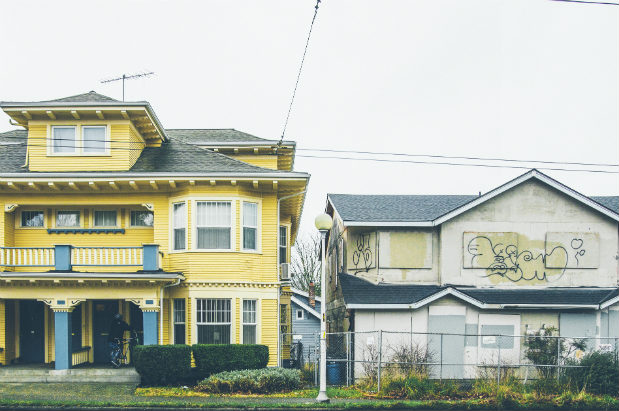

```{r setup, include=FALSE}
knitr::opts_chunk$set(echo = TRUE)
library(tidyverse)
```

# Gentrification of King County: 2009 vs. 2017

Research Question: How has gentrification affected King County in the years 2009 and 2017?

Argument: We hypothesize that more census tracts in the Seattle area will be gentrified in the year 2017 when compared to 2009.

## Context:
According to [Merriam Webster](https://www.merriam-webster.com/dictionary/gentrification), the definition of gentrification is:

> "the process of repairing and rebuilding homes and businesses in a deteriorating area (such as an urban neighborhood) accompanied by an influx of middle-class or affluent people and that often results in the displacement of earlier, usually poorer residents". 

Essentially, gentrification can be thought of as displacing low income, often communities of color to develop new, more expensive properties.



## Racial Restrictive Covenants in Seattle

In the past, there were many racial restrictive covenants which were enforceable contracts that if the owner violated it in any way, would result in them risking the property. Much of this specifies that neighborhoods are reserved for whites, and that "Asiatic, African, or Negro blood, lineage, or extraction" are not allowed to occupy the property. This was common after 1926 when the Supreme Court allowed the use of racial restrictions. However, in 1948, the court declared that it no longer be valid. However, even that did nothing to change the segregation that was already in place. Now, the neighborhoods that predominantly consisted of minorities are now being transformed into areas for those of high income, particularly white and Asian American professionals. One of the places that was heavily impacted by racial restrictive covenants was the Central District. In the 20th century, the working-class minority families were forced into the Central District as it was one of the places that allowed minorities to occupy property. Now, gentrification has transformed the area into a place for those of higher income, displacing families of lower income. As the former Seattle mayor Norm Rice stated: gentrification "clearly isn't racist, it's economic". 


## Seattle Tech Boom

Gentrification has been a prime repercussion to Seattle's advancement in technology. With companies like Microsoft, Boeing, and Amazon, many people were displaced due to new construction and heavier rent. Amazon has become one of the largest tech companies throughout the past two decades with lasting changes all throughout Seattle. What Amazon brought to Seattle was not only an influx of techies, but also a change to many Seattle neighborhoods through rising house prices, traffic, as well as construction. The rise of Amazon resulted in a closure many local shops to create higher class redevelopments. With the influx of techies and a significant increase in tech jobs, many companies moved to Seattle in search for employees and vice versa. With this, many local shops had to close due to increased rent, or construction along with the tech boom. At the same time, many people were displaced due to the increased demand of housing, employees, and redevelopment. 

## Seattle Growth
The U.S Census Bureau has released new numbers for population, and it shows that Seattle has now become the nation's fastest growing city in the decade. Adding up all the growth since 2010, Seattle has grown by 18.7 percent which leaves Texas at second place with 17.9 percent.

## Sources
[Seattle Tech Boom](https://www.businessinsider.com/amazon-hq2-vanishing-seattle-shows-how-the-city-is-gentrifying-2018-2)

[Racial Restrictive Covenants](https://www.seattlemag.com/article/seattles-ugly-past-segregation-our-neighborhoods)

[Gentrification, Integration, or Displacement](https://www.blackpast.org/african-american-history/gentrification-integration-or-displacement-seattle-story/)

## Overview of Data
We decided to focus on King County because we already knew Seattle was a hotspot for gentrification, so we wanted to see if this pattern existed in other parts of the county. Our visualizations will occur at the tract level, since we are familiar with prior datasets that use same.

2009 and 2017 were the first full years of Obama's & Trump's terms respectively?

Data source: American Fact Finder Census Data

Problems with data: Comparing percentages is flawed when there is high population variation among census tracts. Also, housing prices inflate temporally no matter what.

## Methodology
To answer our research question, our group decided to conceptualize our understanding of the term gentrification into separate variables. We selected variables based on the the City of Seattle's DPD (Department of Planning and Development) [report](https://www.seattle.gov/dpd/cs/groups/pan/@pan/documents/web_informational/p2273984.pdf?fbclid=IwAR1FXr6J97_m1tCBzHihvBprQveGuptxuODydrdDtHve6wm4gDNYuMQQHm0), which listed several indicators that represented risk of displacement. 
These variables for each tract include: Ethnicity, Educational Attainment, Median Household Value, Housing Status (Renters vs Buyers), proximity to Link Light Rail.


Another indicator of risk of displacement was proximity to Link Light Rail.
Didn't have time to include this in our spatial visualizations and calculations, but I thought it was worth mentioning.
The census tracts which are nearest to (insert stations here) Stations have been gentrified from 2009 to 2017 the most.

